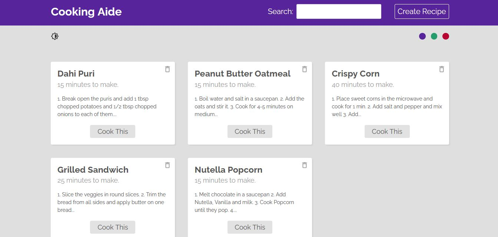
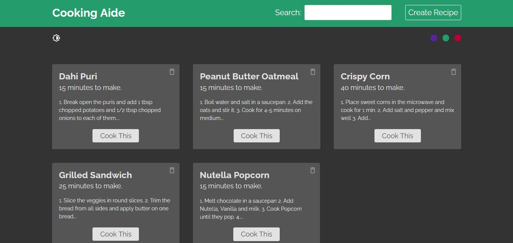

## Cooking Aide

This project is a recipe directory for snacks built using React with the help of React Router and React Hooks. 

## Features

1. View Recipe Collection in Home Page.
2. View each individual Recipe.
3. Search for required Recipe. 
4. Delete Recipes from the collection.
4. Create a new Recipe using a form.
5. Choose a color scheme among red, green and purple.
6. Choose light mode or dark mode.

## Preview

